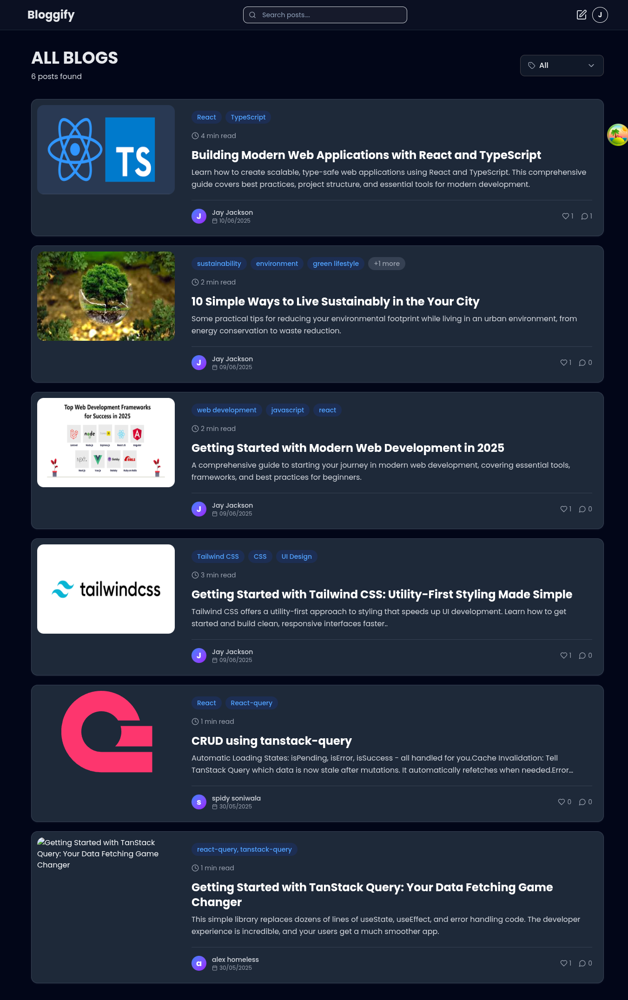
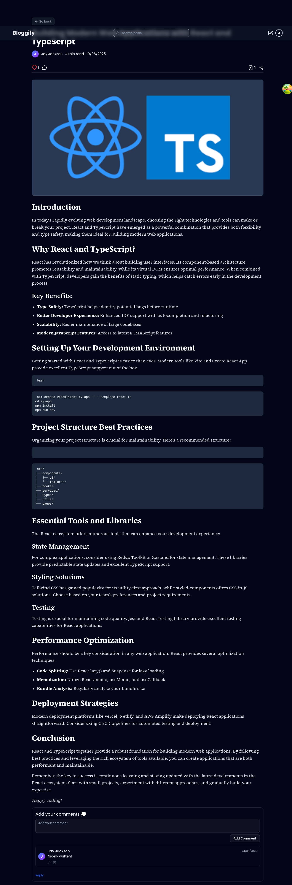
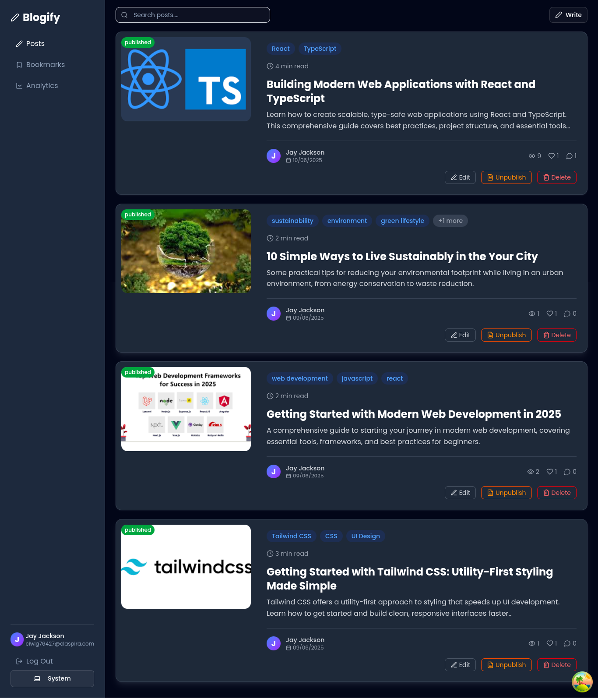
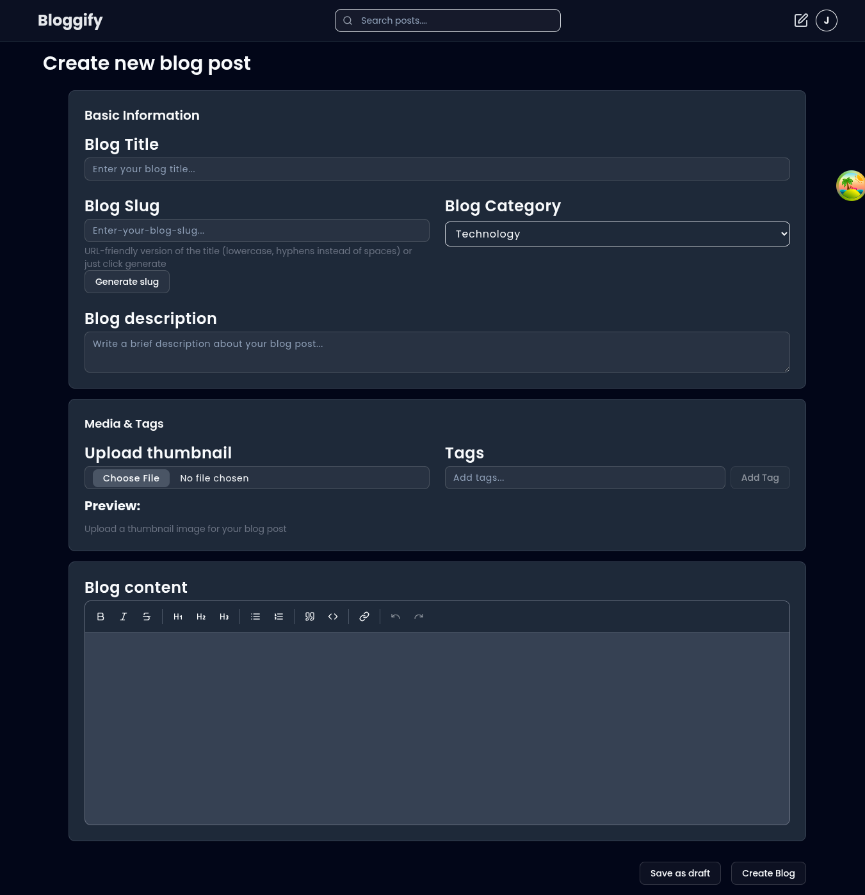

# Bloggify 📝

A modern blogging platform where users can create, read, comment, like, and manage blog posts with dashboard and analytics.

## Live Link 🌐

## 📸 Screenshots

### 🔐 Login Page


### 🏠 Home Page



---

### 📝 Blog Post Page



---

### 📊 Dashboard



---

### ✍️ Create Blog Page



## 🛠️ Tech Stack

- **Framework**: React + Vite
- **Language**: TypeScript
- **Routing**: React Router
- **Styling**: Tailwind CSS
- **State Management**: Redux Toolkit, TanStack Query
- **Backend**: Appwrite (Database, Auth, Storage)
- **Charts**: Recharts

### 🧰 Additional Libraries

- **Rich Text Editor**: Tiptap Editor
- **Form Handling**: React Hook Form + Zod
- **Component Library**: shadcn/ui
- **Icons**: Lucide React

## 💡 Features

- User authentication (signup, login)
- Create, edit, and delete blogs
- Like and comment on posts (with reply support)
- Blog dashboard with analytics (views, likes, comments)
- Dark mode support
- Responsive design for all screen sizes

## 📦 Installation

### 1. Clone Repository

```bash
git clone https://github.com/charukirti/blog-app
cd blog-app
```

### 2. Install Dependencies

```bash
pnpm install
```

### 3. Setup environment variables

```bash
VITE_APPWRITE_URL=https://your-appwrite-endpoint.com/v1
VITE_APPWRITE_PROJECT_ID=your_project_id
VITE_APPWRITE_DEV_KEY=your_dev_key

VITE_APPWRITE_DATABASE_ID=your_database_id
VITE_APPWRITE_POSTS_COLLECTION_ID=your_posts_collection_id
VITE_APPWRITE_COMMENTS_COLLECTION_ID=your_comments_collection_id
VITE_APPWRITE_LIKES_COLLECTION_ID=your_likes_collection_id
VITE_APPWRITE_BOOKMARKS_COLLECTION_ID=your_bookmarks_collection_id

VITE_APPWRITE_BUCKET_ID=your_bucket_id
```

### 4. Start development server

```bash
pnpm run dev
```
